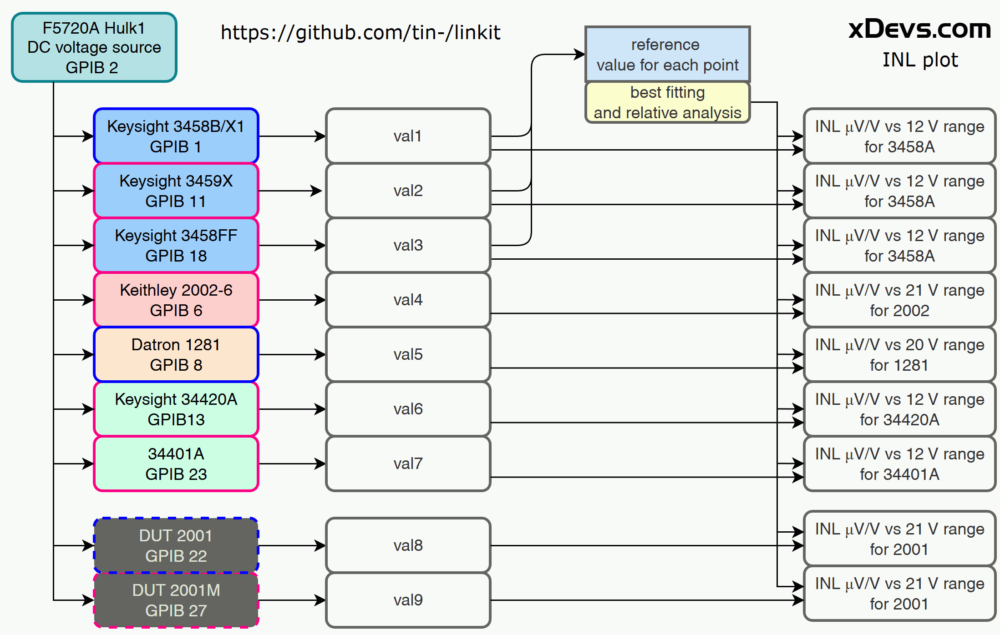
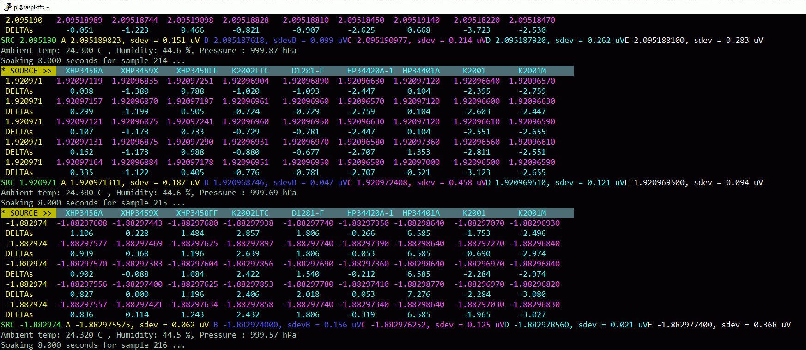
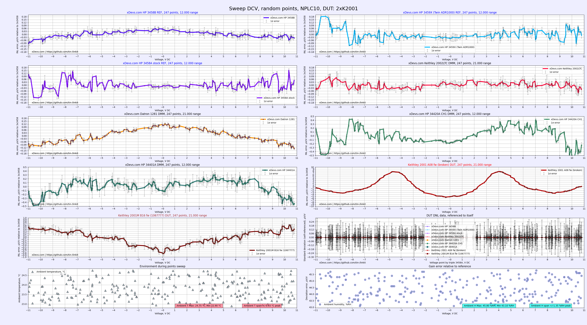
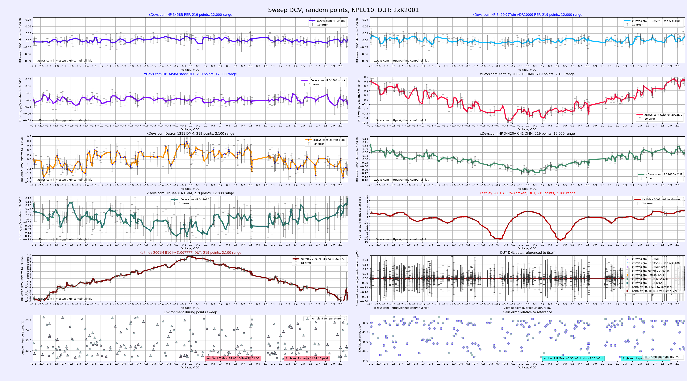

# Combined linearity test for nine DMM, using DC Voltage source

DMM9 experiment
------------

This directory contains the data collected on 9 different DMMs with DC voltage performance sample. Process very similar to what's explained in [this xDevs.com article](https://xdevs.com/article/inlperf/).

Source was connected in parallel to all DMMs. Python script was used to perform programming of the instruments and setting random voltage point to 6 digits of resolution.
In this experiment [rebuilt Fluke 5720A calibrator was utilized](https://xdevs.com/article/hulk)

Multimeters were used in locked range at 12 V or 21 V (or 20 V for Datron 1281).

* [Hewlett-Packard 3458A 8&frac12;-digit DMM](https://xdevs.com/fix/hp3458) - with lowered temperature for LTZ oven A9 and golden A3.
* [Hewlett-Packard 3458A 8&frac12;-digit DMM](https://xdevs.com/fix/hp3458_u2) - with [twin xDevs.com X9D Analog ADR1000 reference](https://xdevs.com/pow/x9d_mod/)
* [Hewlett-Packard 3458A 8&frac12;-digit DMM](https://xdevs.com/pow/hp3458ff)
* [Keithley 2002 8&frac12;-digit DMM](https://xdevs.com/fix/kei2002_u2) with [modified binding posts](https://xdevs.com/article/kei2002ltc/)
* [Datron 1281 8&frac12;-digit DMM](https://xdevs.com/fix/d1281)
* [Hewlett-Packard 34420A 7&frac12;-digit DVM/nanovoltmeter](https://xdevs.com/fix/hp34420a_u2/)
* [Hewlett-Packard 34401A 6&frac12;-digit DMM](https://xdevs.com/pow/hp34401a_pow/)
* Broken Keithley 2001 7&frac12;-digit DMM
* Keithley 2001M 7&frac12;-digit DMM freshly adjusted

Data in this repository was collected and analyzed for an example how INL in sub-ppm level can be measured using conventional metrology equipment.
Python script to collect sample points available [on xDevs here](https://xdevs.com/doc/xDevs.com/inlstudy/dmm9/linkit_rnd2001b.py)

Script saves all measurement results into timestamped delimiter-separated text value file, such as [this](dcl_rnd_10v_h1_k2001_nplc10_soak8s_comp_samples-3_jun2026.dsv). As script is logging data it gives some test information like measured value for each device on the colorized terminal output:

Then analysis [linplot.py plotter script](linplot.py) together with [linkit2.conf config file](linkit2.conf) generate sorted and analyzed graphical chart set that displays each DMM performance from collected data samples. Two PNG images created with higher and smaller resolution for convinience. If everything working right, rendered charts look like this for base voltage range on each DMM:

And for lower range like 2.1 V:

Hope this helps! Plotter often needs some tweaking for different ranges in multiple DMMs, but core functionality is all there and should be rather easy to modify to your needs after bit of experimenting.
